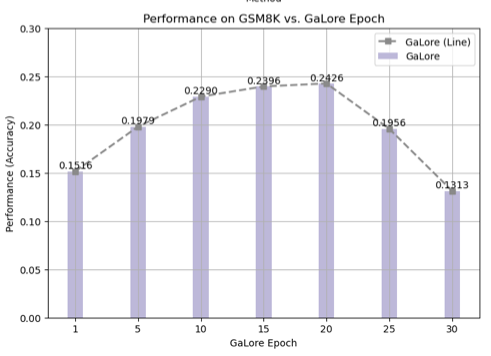

# Fine-tuning-Large-Language-Models-for-Task-Specific-Performance

# Large Model Fine-tuning Framework

This repository provides implementations for fine-tuning large language models using three different methods: **LoRA, RoSA, and GaLore**. We apply these methods to two benchmark tasks: **GSM8K (Mathematical Reasoning)** and **News Summary (Text Summarization)**.

The framework supports both **training and evaluation**, making it easy to experiment with different fine-tuning strategies.

## Features

- Supports three fine-tuning methods:
  - [LoRA](https://arxiv.org/abs/2106.09685) (Low-Rank Adaptation)
  - [RoSA](https://arxiv.org/abs/2401.04679) (Robust Adaptation)
  - [GaLore](https://arxiv.org/abs/2401.04679) (Gradient Low-Rank Adaptation)
- Fine-tuning for two tasks:
  - GSM8K (Grade School Math 8K dataset)
  - News Summarization
- Configurable hyperparameters for easy experimentation
- Supports evaluation and inference with trained models

### Pipeline Overview


## Installation

### Prerequisites
- Python 3.8+
- PyTorch 2.0+
- CUDA (for GPU training)
- Transformers 4.39.0 (Hugging Face)
- Datasets (Hugging Face)

### Setup
Clone the repository and install dependencies:
```bash
git clone https://github.com/verach3n/Fine-tuning-Large-Language-Models-for-Task-Specific-Performance.git
cd Fine-tuning-Large-Language-Models-for-Task-Specific-Performance
```
Due to package conflicts, two separate environments are required. Install dependencies as follows:

1. **First Environment**  
   Install dependencies from `requirements1.txt`:
   ```bash
   pip install -r ppl/requirements1.txt
    ```

2. **Second Environment**  
   Install dependencies from `requirements2.txt`:
   ```bash
   pip install -r ppl/requirements2.txt
    ```

## 4. Usage

### Environment
This repository is designed to run in a **SLURM-based HPC cluster**.  
All training and evaluation scripts should be submitted using `sbatch`, rather than running them directly with `bash`.

### Training
Each task (GSM8K, News) supports training with LoRA, RoSA, and GaLore. The training jobs must be submitted to SLURM using `sbatch`.

#### Example (GSM8K Task)
```bash
cd ppl/gsm8k
sbatch scripts/lora.sh  # Submit LoRA training job to SLURM
sbatch scripts/rosa.sh  # Submit RoSA training job to SLURM
sbatch scripts/galore.sh  # Submit GaLore training job to SLURM
```
### Evaluation
To evaluate trained models, submit evaluation scripts using `sbatch`:

#### Example (GSM8K Task)
```bash
cd ppl/gsm8k
sbatch scripts/eval.sh
```
#### Example (News Summary Task)
```bash
cd ppl/news
sbatch scripts/eval.sh
```

## 5. Configuration

The training and evaluation scripts are configured using SLURM directives and Python arguments.

- **Hyperparameters:** Modify training scripts (`lora.sh`, `rosa.sh`, `galore.sh`) to adjust batch size, learning rate, and model-specific settings.
- **SLURM Job Settings:** Each script includes `#SBATCH` directives to allocate resources.
- **Adapter Merging:** Use `merge_adapter.py` to merge fine-tuned adapters into a final model.

#### Example SLURM Job Configuration
```bash
#SBATCH -A <your_project_id>       # Specify your project ID (check with "projinfo" command)
#SBATCH -p <partition_name>        # Specify the partition (if needed, otherwise remove)
#SBATCH -t 10:00:00                # Max runtime (10 hours)
#SBATCH --gres=gpu:A100:1          # Request 1 A100 GPU (correcting syntax)
#SBATCH --output=logs/eval_%j.out  # Store stdout (using %j for job ID)
#SBATCH --error=logs/eval_%j.err   # Store stderr (using %j for job ID)
```

To monitor submitted jobs:
```bash
squeue -u $USER   # Check job status
scancel <JOB_ID>  # Cancel a job
```

## 6. Results

Below are the experimental results for GSM8K and News-summary tasks using LoRA, RoSA, and GaLore.

### GSM8K Task





### News Summary Task


### Computational Resource Usage


## 7. File Structure
The repository is organized as follows:

```bash
ppl/
├── gsm8k/                 # Implementation of LoRA, RoSA, and GaLore for the GSM8K task
│   ├── scripts/           # Shell scripts for running and evaluating models
│   │   ├── lora.sh        # Script for running LoRA on GSM8K
│   │   ├── rosa.sh        # Script for running RoSA on GSM8K
│   │   ├── galore.sh      # Script for running GaLore on GSM8K
│   │   ├── eval.sh        # Evaluation script for GSM8K
│   ├── lora.py           # LoRA implementation for GSM8K
│   ├── rosa.py           # RoSA implementation for GSM8K
│   ├── galore.py         # GaLore implementation for GSM8K
│   ├── eval.py           # Evaluation script for GSM8K
│   ├── merge_adapter.py  # Script for merging adapter weights
├── news/                 # Implementation of LoRA, RoSA, and GaLore for the News task
│   ├── scripts/           # Shell scripts for running and evaluating models
│   │   ├── run.sh         # Script for executing the pipeline
│   │   ├── eval.sh        # Evaluation script for News task
│   ├── lora.py           # LoRA implementation for News
│   ├── rosa.py           # RoSA implementation for News
│   ├── galore.py         # GaLore implementation for News
│   ├── eval.py           # Evaluation script for News
│   ├── merge_adapter.py  # Script for merging adapter weights
├── requirements1.txt     # Dependencies for environment 1
└── requirements2.txt     # Dependencies for environment 2
```


